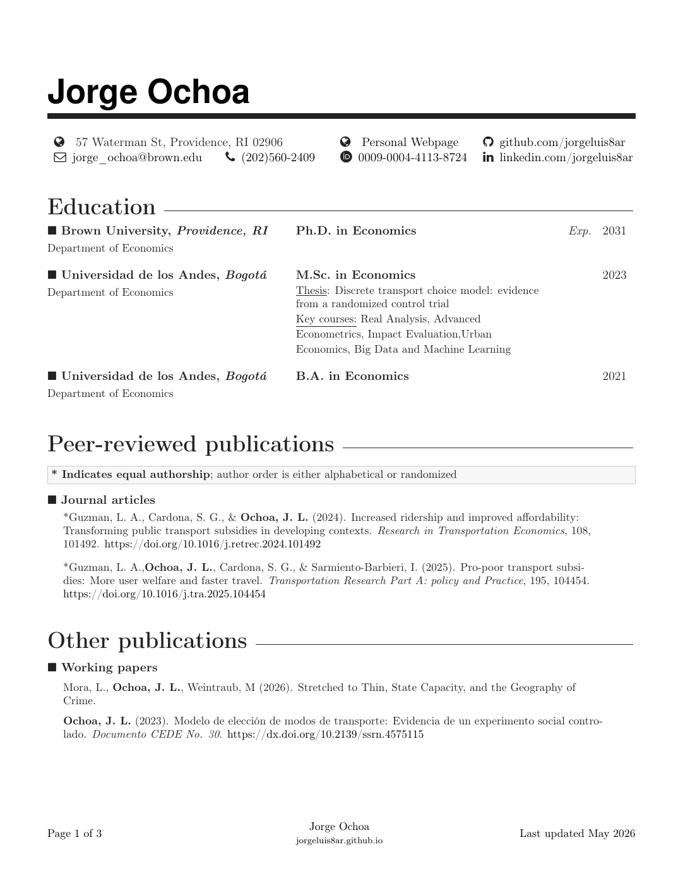

```{css, echo=FALSE}
#title-block-header .description {
    display: none;
}
```

```{css echo=FALSE}
.cv-preview-shell {
    max-width: 820px;
    margin: 0 auto;
}

.cv-preview-link {
    display: block;
    text-decoration: none;
}

.cv-preview-link img {
    width: 100%;
    border: 1px solid rgba(0, 0, 0, 0.12);
    border-radius: 0.75rem;
    box-shadow: 0 12px 28px rgba(0, 0, 0, 0.12);
}
```

```{=html}
<p class="text-center">
  <a class="btn btn-primary btn-lg cv-download" href="`r rmarkdown::metadata$cv$pdf`" target="_blank">
    <i class="bi bi-file-arrow-down"></i>&ensp;Download current CV
  </a>
</p>

<div class="cv-preview-shell">
  <a class="cv-preview-link" href="`r rmarkdown::metadata$cv$pdf`" target="_blank" rel="noopener">
    
  </a>
</div>
```
